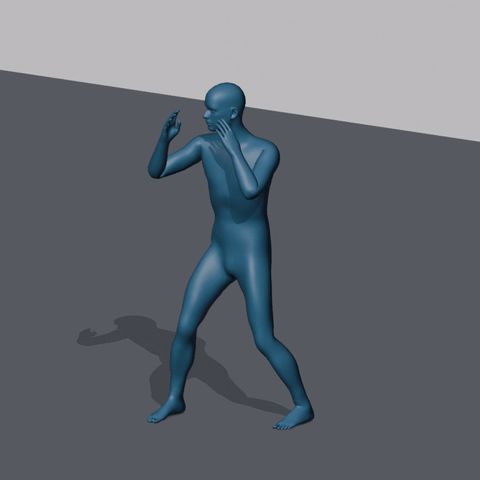

# ARDY 战斗待机：4 秒原地循环

徒手防守待机：双手护住脸部，双肘弯曲，双脚分开并前后错开，膝盖微屈，身体和手臂有小幅自然变化。这一版使用 ARDY 参考人体，手指呈张手状态；Core27 没有完整手指链，不能精确表现握拳。对完整角色重定向后，可叠加角色自身的握拳姿势。



## 直接使用

- **Blender：**打开 [ARDY_CombatIdle_Core28.blend](artifacts/ARDY_CombatIdle_Core28.blend)，按空格。Action 为 `ARDY_CombatIdle_Loop_v1`，播放范围 1–80，20 FPS，4 秒循环。
- **视频：**[MP4 预览](artifacts/CombatIdle_Preview.mp4)。视频是真实 Blender 动画渲染，80 帧，768×768。
- **UE 动画：**[AN_ARDY_CombatIdle_Loop.fbx](artifacts/AN_ARDY_CombatIdle_Loop.fbx)。导入到同一套 ARDY Core28 Skeleton，关闭 Import Mesh、启用 Import Animations，采样率 20 FPS。
- **首次使用 ARDY 骨架：**先导入 [SK_ARDY_Core28.fbx](artifacts/SK_ARDY_Core28.fbx)，Skeleton 选 None，关闭动画导入，再导入动画文件。
- **纯骨骼动作：**[ARDY_CombatIdle_Core27.bvh](artifacts/ARDY_CombatIdle_Core27.bvh)。米制 Blender 场景导入 Scale 0.01，Forward -Z、Up Y，20 FPS。

FBX 和 BVH 含 81 个采样点，其中第 81 帧与第 1 帧完全相同，首末跨度正好 4 秒。Blender 播放范围只含 80 个不重复采样点，避免重复终点停顿；不要把 FBX 拉伸成 4.05 秒。

这是 **In-place 原地动画**，独立 `root` 固定，微小重心移动保留在 `pelvis`。UE 待机状态可启用动画循环，无需用 Root Motion 推进角色。应用到 Manny/Quinn 或自己的角色时，需要 IK Rig / IK Retargeter；不能在导入阶段直接选 Manny Skeleton。映射步骤沿用上一阶段 Blender → UE 指南。

## 来源与加工

使用 NVIDIA ARDY 官方代码 commit `693f74d13b3d04a0a22ce127ee79c929dd89756b`、`ARDY-Core-RP-20FPS-Horizon8`、seed 42，一批生成 3 条 6 秒/120 帧候选，关闭上游后处理。低显存文字条件仍为第三方 NF4 LLM2Vec，本轮在 CUDA 上单独编码并释放后，再加载动作模型；两者没有同时驻留。本地 CPU 编码尝试因耗时过长中止，不作为完成结果。

实际选用的提示词：

> A person stands still in a boxing guard stance, both fists raised in front of the face, elbows bent, knees slightly bent, feet planted apart. They maintain the fighting stance with subtle breathing and small weight shifts, without punching or stepping.

选择 `guard_00.npz` 第 40–119 帧（从 0 计数），因为它持续保持防守、移动幅度小；第二个候选出现明显侧移，未采用。原始文件保存在 `source/guard_00.npz`。原始提示虽要求握拳，参考网格实际为张手，不能把提示词当成输出事实。

最终结果 `outputs/combat_idle_loop.npz` 是生成后加工的版本：局部旋转围绕 SO(3) 均值做双谐波周期拟合，骨盆位置也做周期拟合；双骨腿 IK 固定脚踝位置与脚部朝向；依据参考网格真实脚底高度校正接地；最后添加固定的独立 root。不是声称模型原生输出了无缝循环或完美接地。原始生成文件没有覆盖。

## 已验证

- Blender 5.2.2 LTS 实际导入 BVH、重新打开 `.blend`、重新导入静态和动画 FBX。
- 28 骨，`root → pelvis`，骨架对象 scale=(1,1,1)，FBX 包含 1–81 帧。
- FBX 回读最大关节误差约 0.000113 cm；root 全帧无位移或旋转漂移。
- 循环起止骨骼与网格位置相同；离散边界速度差约 0.00120 m/s，不代表解析速度完全相等。
- 实际参考网格的脚底距离地面约 0.1 mm；全帧抽取的脚底顶点水平漂移小于 0.00004 cm。
- 检查了正面、侧面与 0/1/2/3/4 秒的渲染画面；完成 80 帧视频渲染。未见明显肢体反向、网格塌缩或采样画面的地面穿入。
- 3 个数学测试覆盖周期采样、旋转跨越 180° 和腿长/膝盖弯曲方向。

报告在 `artifacts/*report.json`，循环处理报告在 `outputs/combat_idle_loop.json`。这是参考人体的验证；**未在 UE 中导入，也未验证 Manny、MetaHuman 或用户角色重定向后的效果**。目标角色的手指、肘部、脚接触仍须检查。

## 重建

这些脚本用于这次 Core27 待机片段，没有封装成通用 Blender 插件。直接打开交付文件无需安装 ARDY 或下载权重。

从 LearnGithub 重建时，在包含原 `summary.md` 的目录运行，使用部署说明中的 `runtime/venv` 环境。先执行数学测试，再从已保存的原始动作重建；输出置于新 runtime 目录，避免覆盖交付物：

```powershell
$ardyBlender = 'F:/Program Files (x86)/Steam/steamapps/common/Blender/blender.exe'
runtime/venv/Scripts/python.exe combat-idle/test_loop_math.py
runtime/venv/Scripts/python.exe combat-idle/make_loop.py combat-idle/source/guard_00.npz --start 40 --stop 120 --frames 80 --out runtime/combat-idle-rebuild/combat_idle_loop.npz
runtime/venv/Scripts/python.exe combat-idle/convert_bvh.py runtime/combat-idle-rebuild/combat_idle_loop.npz --out runtime/combat-idle-rebuild/artifacts
& $ardyBlender --background --factory-startup --python-exit-code 1 --python combat-idle/build_blender.py -- --artifacts runtime/combat-idle-rebuild/artifacts
& $ardyBlender --background --factory-startup --python-exit-code 1 --python combat-idle/verify_saved_exports.py -- --artifacts runtime/combat-idle-rebuild/artifacts
& $ardyBlender --background --factory-startup --python-exit-code 1 --python combat-idle/render_preview.py -- --artifacts runtime/combat-idle-rebuild/artifacts
ffmpeg -framerate 20 -start_number 1 -i runtime/combat-idle-rebuild/artifacts/preview-frames/%04d.png -c:v libx264 -crf 19 -pix_fmt yuv420p -movflags +faststart runtime/combat-idle-rebuild/artifacts/CombatIdle_Preview.mp4
```

完整重做 ARDY 候选需要前一阶段下载的模型：先用 `scripts/encode_prompts.py` 编码上方原文，输出到独立缓存；再用 `scripts/generate_cached.py`，参数为 `--model core8 --duration 6 --num_samples 3 --seed 42 --no-postprocess`。文字编码器可在有足够空余显存时用 `--device cuda`，编码结束退出进程后再生成动作。`encoder-manifest.json` 和 `generation-guard.json` 记录本次实际来源与耗时；未上传模型权重或 embedding 二进制。

源码与参考人体来自 [NVIDIA ARDY](https://github.com/nv-tlabs/ardy/tree/693f74d13b3d04a0a22ce127ee79c929dd89756b)。许可见 [LICENSE-ARDY.txt](LICENSE-ARDY.txt)，修改说明见 [THIRD-PARTY-NOTICES.md](THIRD-PARTY-NOTICES.md)。
