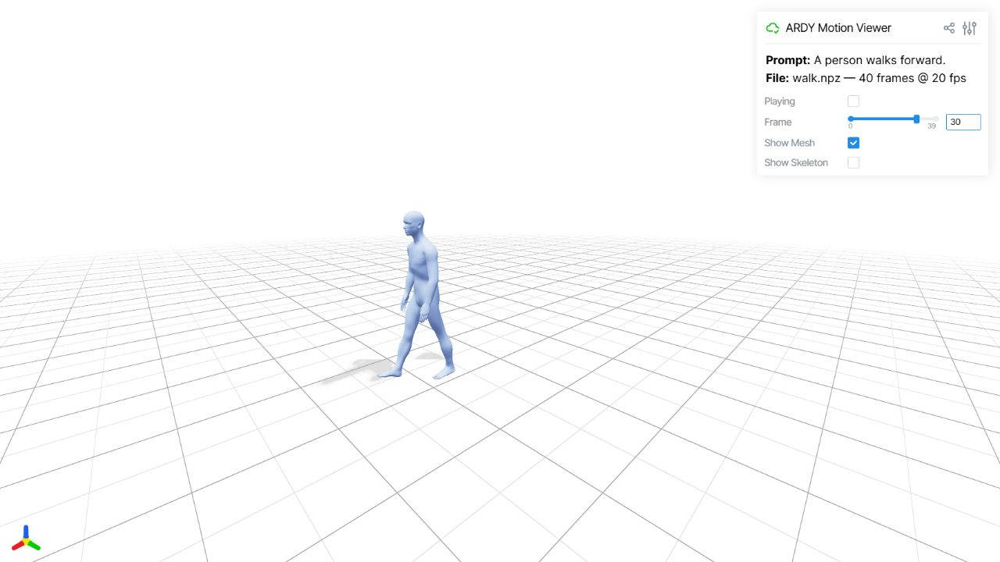
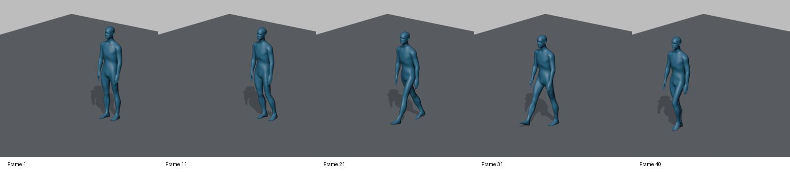

# B 站视频研究与 NVIDIA ARDY 本地 Demo

## 研究对象

- 视频：[实时AI动画来了！NVIDIA ARDY免费本地运行，只需6GB显存](https://www.bilibili.com/video/BV15i3d6jEYV/)
- BV 号：`BV15i3d6jEYV`
- 视频时长：约 18 分 14 秒
- 研究日期：2026-09-23（Asia/Shanghai）
- 官方项目：[NVIDIA ARDY](https://research.nvidia.com/labs/sil/projects/ardy/)
- 官方仓库：[nv-tlabs/ardy](https://github.com/nv-tlabs/ardy)
- 使用的代码 commit：`693f74d13b3d04a0a22ce127ee79c929dd89756b`
- 使用的模型：[ARDY-Core-RP-20FPS-Horizon8](https://huggingface.co/nvidia/ARDY-Core-RP-20FPS-Horizon8)

## 证据边界

B 站页面可访问标题和视频，但匿名状态没有提供正式字幕；字幕检查只列出弹幕 XML，并提示正式字幕需要登录。视频步骤依据公开音轨的本地 ASR 辅助转写，存在明显误识别，不能当作逐字字幕，也不表示逐帧看完了视频。项目事实以 NVIDIA 官方仓库/README 为准；硬件、耗时和输出形状以本机实测为准。另参考了 [Gachoki 的同主题教程](https://gachoki.com/nvidia-ardy-just-made-real-time-ai-animation-possible-on-a-6gb-graphics-card/)，其内容属于二手资料。

视频展示的路线是：Windows 10/11、Python 3.12、低显存 NF4 文字编码器、启动本地服务器、浏览器交互式生成、文本提示、路径点、约束、键盘控制和 BVH 导出，再把动画导入 Blender 并重定向到角色。视频提到的 AeroX/NF4 安装批处理和作者自定义启动器没有作为官方 ARDY 代码使用；本次 demo 使用官方仓库的命令行生成脚本，并将文字编码器替换为本机已有的 NF4 LLM2Vec 缓存。

## 本机条件

- Windows 11 原生环境，未安装 WSL。
- RTX 4060 Laptop GPU，8 GB 显存；实验开始时约 5 GB 可用。
- NVIDIA 驱动 595.79。
- Python 3.12.4；实验环境：`verification/ardy/demo_v1/venv`。这是一个 overlay 环境，通过 `.pth` 复用了既有 Kimodo 的库，不是从空机器完整重装。Viser 前端构建也写入了这个共享库的客户端目录。
- PyTorch `2.5.1+cu121`，CUDA 可用。
- ARDY 的 C++ motion-correction 扩展构建成功。

官方 README 的默认 LLM2Vec 文字编码器约需 14 GB 显存，不能直接放进本机 8 GB GPU。本次使用 `Aero-Ex/KIMODO-Meta3_llm2vec_NF4` 在 CPU 上编码提示词，属于低显存实验偏差；生成阶段单独运行，不让编码器和 ARDY denoiser 同时占用 GPU。最初调用 Kimodo 的编码实现，随后用 ARDY 自带的实现重跑走路提示词，embedding 哈希完全一致；仓库中的最终脚本使用 ARDY 自带代码。

## 可复现部署

下面是已部署机器上的重跑命令，路径相对于本研究项目根目录。其他机器从 LearnGithub 克隆后，请使用 [部署说明](deployment.md)，其中明确区分本机实测和干净环境安装建议。模型下载器固定 Hugging Face revision，对所有权重和统计文件做大小/哈希校验，不能只检查最大的权重文件。

本机使用已生成的 embedding：

```powershell
verification/ardy/demo_v1/venv/Scripts/python.exe `
  verification/ardy/demo_v1/generate_cached.py `
  --ardy-root third_party/ardy `
  --embeddings verification/ardy/demo_v1/embeddings `
  --report verification/ardy/demo_v1/generation-report.json `
  "A person walks forward." `
  --model core8 --duration 2 --seed 0 `
  --output verification/ardy/demo_v1/outputs/walk `
  --checkpoints_dir verification/ardy/demo_v1/checkpoints `
  --no-postprocess
```

浏览器预览：

```powershell
verification/ardy/demo_v1/venv/Scripts/python.exe `
  third_party/ardy/scripts/visualize.py `
  verification/ardy/demo_v1/outputs/walk.npz --port 2334
```

打开 <http://localhost:2334>。本机也可运行 `verification/ardy/demo_v1/start-demo.cmd`。已实际检查第 0、30 帧及播放状态：人体从站立过渡到迈步，位置和腿姿发生变化；未见明显骨架塌缩。这是短样本目视检查，不是完整接触/穿模质量评估。



首次启动 Viser 需要构建客户端。本次先用系统 Node.js 安装依赖；`npm run build` 遇到上游 CameraControls 的 4 个 TypeScript undefined 错误。随后使用上游 Python 自动构建器本身采用的 `vite build --base ./ --outDir build` 成功；这不表示类型检查通过，也未修复该上游错误。

## 真实验收结果

固定输入：`A person walks forward.`；模型：`ARDY-Core-RP-20FPS-Horizon8`；时长 2 秒；种子 0。

- 输出：`demo-artifacts/walk.npz`
- 40 帧，27 个 Core joints，20 FPS。
- `posed_joints`、`local_rot_mats`、`global_rot_mats`、`root_positions` 全部 finite。
- 相邻帧最大位置变化约 `0.2076`，不是静止或空文件。
- 文件包含脚接触、根位置和文本字段，可被官方 `visualize.py` 读取。
- 首次模型加载约 1.11 秒，计时区间约 2.53 秒；最终脚本重跑加载约 2.05 秒，计时区间约 3.35 秒，所有输出数组与首次完全相同。
- 上述区间包含模型加载、缓存条件读取、动作生成、解码和保存，**不包含进程/import 启动、下载以及前置文字编码**。CPU NF4 走路提示词最初编码约 110 秒，ARDY 实现复核约 83 秒；因此不能称首次文本输入端到端实时。
- CUDA 峰值 allocated 约 883.8 MiB，reserved 约 904 MiB。
- 加速方式：PyTorch eager，无 TensorRT。

这些数字只代表 2 秒短序列，不能证明“6 GB 显卡端到端实时”。路径点、约束、键盘控制属于官方交互 demo，尚未在本机实测；视频中的 BVH 导出归于作者的第三方扩展，也未安装/验收。本次完成官方模型真实生成 + 网格动作预览，并在后续用自制转换脚本完成本样本的 BVH、Blender 工程和 FBX 导出/回读验证，见下方说明。未完成目标角色重定向或整套教程功能。

## 视频步骤索引（ASR 近似时间）

| 时间 | 内容与核对 |
|---|---|
| 01:33–03:48 | AeroX 低显存、Python 3.12、安装/启动批处理、首次下载 NF4；第三方路线，未执行作者批处理 |
| 04:17–07:07 | 更新提示词、拼接动作、Restart 与 Restart From Now；官方 README 可核对两者行为差别 |
| 07:31–09:30 | `P` 路径点、指定时间的姿态约束；官方支持，未本机测试 |
| 09:31–11:39 | `T` 与方向键控制速度/方向，结合提示词和路径；官方支持，未本机测试 |
| 11:40–12:54 | BVH 导出与帧范围；ASR 的 BPH 为误识别，属于教程扩展，不能归为本机已验证功能 |
| 12:55–16:15 | 模型、Mixamo 绑定、Blender 导入与 Rokoko 重定向/缩放；本次未执行 |
| 16:16–18:14 | 角色体型带来的碰撞和后期修正；不要照搬删除关键帧覆盖原动作的做法 |

## Blender 与 Unreal Engine 文件

已为本次 40 帧样本提供 [Blender → UE 使用指南](blender-ue/README.md) 和 [交付文件](blender-ue/artifacts/)：

- `ARDY_Walk_Core28.blend`：带官方参考人体和动画，直接打开并播放。
- `ARDY_Walk_Core27.bvh`：可导入其他 Blender 场景的纯骨骼动作。
- `SK_ARDY_Core28.fbx`：用于在 UE 首次创建独立 ARDY Skeleton。
- `AN_ARDY_Walk_RootMotion.fbx`：向前位移约 1.47 米的动画，导入时指定上述 ARDY Skeleton，再通过 IK Retargeter 转到 Manny 或目标角色。



自制转换流程已在 Blender 5.2.2 LTS 验证 BVH 实际导入、保存工程重新打开、静态/动画 FBX 重新导入；动画保持 40 帧、20 FPS、`root → pelvis`，FBX 回读最大关节误差约 0.000119 cm。**这是 Blender 侧验证；UE 导入、目标角色重定向与脚滑修正尚未实测。**当前动作从站立进入迈步，首尾并非无缝循环。此导出不是视频作者的第三方扩展。

视频展示的后半段是：在 Blender 导入 BVH，准备 Mixamo/自有角色，用 Rokoko 或其他重定向工具把 ARDY 动作映射到角色，再检查比例、碰撞和手脚接触。重定向属于独立的 Blender Pose/Binding 阶段；不要把“能生成 `.npz`”当作角色绑定成功。项目中的 Blender v4 baseline 和已有 Action 均未修改。

## 已知限制

1. 匿名 B 站访问没有正式字幕；ASR 文本只用于定位步骤。
2. AeroX/NF4 文字编码器是本地实验替换，不等价于官方 BF16 LLM2Vec。
3. 本机没有 WSL，也没有为 TensorRT 编译引擎；使用原生 Windows + PyTorch eager。
4. 没有把模型权重、虚拟环境、音频、完整转写或 embedding 二进制上传到仓库。
5. 首次 Hugging Face 下载曾遇到一次 502；重试后所有文件通过固定 revision 的大小和哈希校验。

## 仓库内材料

- `demo-artifacts/walk.npz`：真实生成的短动作样本。
- `demo-artifacts/generation-report.json`、`generation-repeat-report.json`：两次运行的耗时、CUDA 和显存记录。
- `demo-artifacts/validation-report.json`、`visual-report.json`、`viewer-frame-*.png`：数值和独立画面检查。
- `demo-artifacts/encoder-manifest.json`：编码来源、耗时与哈希，不含 embedding 二进制。
- `demo-artifacts/download-report.json`：模型文件校验记录。
- `scripts/`：编码、下载、缓存条件生成和最小测试脚本。
- `blender-ue/`：Blender/FBX/BVH 文件、转换脚本、使用指南、许可和验证报告。
- [bilibili-video-research skill](../../../Claude-Code-技能-插件/bilibili-video-research/SKILL.md)：可复用的视频研究与部署验收流程。
